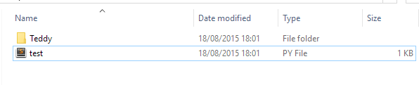
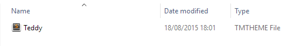
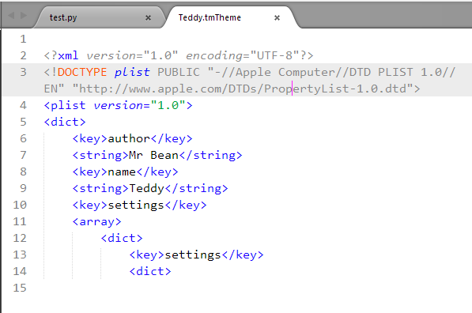
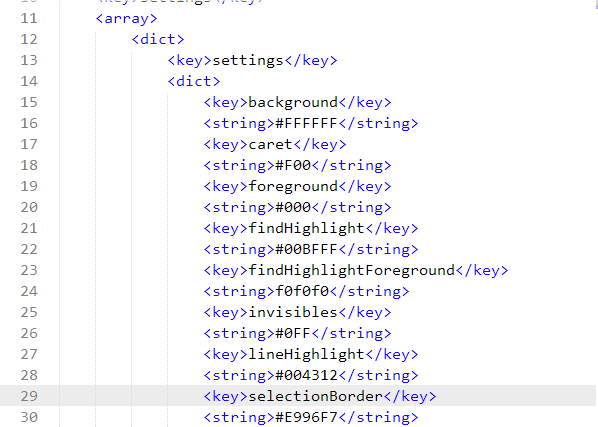
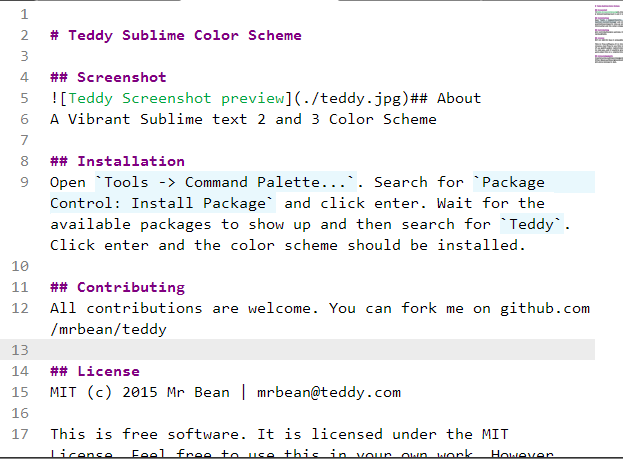
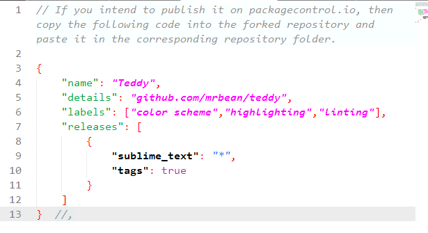
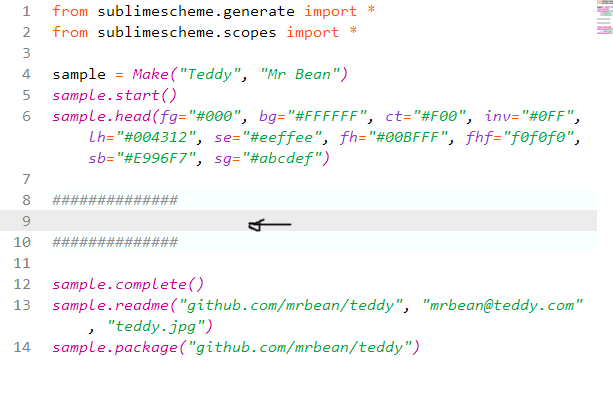
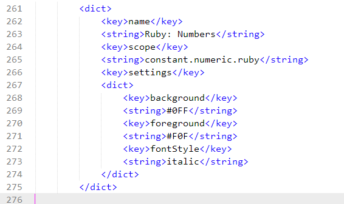
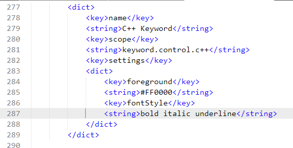

# [Sublimescheme ](index.html)

## [Walkthrough](walkthrough.html)

This tutorial will show you the basics of creating a Theme assuming that you have installed [Sublimescheme package](https://pypi.python.org/pypi/Sublimescheme).

> If you are getting any problem after installation, please uninstall and if possible delete the package from the directory it is stored(Although not really required)

As at this walkthrough, the current version was **v1.0.6** 

If you have a version lesser than this, please use

	pip install sublimescheme upgrade

### Creating your first color scheme

First create a folder to make things organised. Give this any name and create a new **.py** file into it. Also give this .py file any name.

	I have created a file called "test.py" inside a directory(folder) called "test"

In the .py file *(in my case, test.py)* import the **sublimescheme** package this way:

	from sublimescheme.generate import *
	from sublimescheme.scopes import *

> The `sublimescheme.generate` will enable you to create your color schemes while the `sublimescheme.scopes` will allow you to see and remind you of the available scopes you can use for syntax highlighting in case you want to write a lot. This will really come in handy. You can also check them [here](https://github.com/tushortz/scopes)

#### Generating the Color scheme's head document 

We will be making use of the **Make** class of the `generate` module:

> Make accepts two arguments only, the first being the `theme's name`. It will also be used as the folder name but you can always rename if afterwards. and the second being `Author's name`. This name will be used when generating a README file as well as in the theme to specify an author.

So create an instance of make. You can choose any name but i have chosen *sample*

	sample = Make("Teddy", "Mr Bean")

A folder will now be created as shown below

 

Inside the folder, an empty **.tmTheme** file is also created. This is where all the syntax highlighting information will be populated to.

 

 

At the moment the *teddy.tmTheme* file is empty and we will now populate it with some lines of code in the *test.py* file.

In your python file *(mine being test.py)*, call `.start()` on your class instance as shown below

	sample = Make("Teddy", "Mr Bean")

 

The result will look something like this:

 
To generate the interface for your sublime text,you need to call **.head()** on your class instance.as shown in the folowing code:

	sample.head(fg="#000", bg="#FFFFFF", ct="#F00", inv="#0FF", lh="#004312", se="#eeffee", fh="#00BFFF", fhf="f0f0f0", sb="#E996F7", sg="#abcdef")

>**Note:** All the arguments are completely optional but add more functionalities to your theme.

 

>> options are:
		bg --> background
		ct --> caret
		fg --> foreground
		fh --> findHighlight
		fhf --> findHighlightForeground
		inv --> invisibles
		lh --> lineHighlight
		sb --> selectionBorder
		se --> selection
		sg --> stackGuide

>while the values must be valid **HEX color values**.

-------------- 
 
This will generate similar things as these. 

 

**Generating the Color scheme's body document**
*Leave three new lines after your .head() code*

>**Note:** We have skipped the body part for now. Let's leave the best for the last.

#### Completing the Color Scheme

Call **.complete()** on your class instance to finish up the theme and add the remainnig necessary codes.
	
> You could pass in an optional "uuid" argument to *.sample* so that you will have a "Universally unique identifier" which can be found at [Online UUID Generator](https://www.uuidgenerator.net/).

>> If you don't provide one, a default uuid will be generated for you but you will be surprised that thousands of other users will have the same UUID as you.

	sample.complete()		#or

	sample.complete(535f5083-56d4-4f0b-a084-4176d3c3d765)

> Your *.theme* is now complete. Feel free to take a look at it as a Python IDLE look-alike theme is now generated for you. 240+ lines of codes without sweat. Easy right?

 

#### Generating a README file

This is optional but in case you want to share yuor theme and a readme file is needed. Readme could be passed no argument or one, two or even three. They are:
	
	readme (repository URL, user email, screenshot)

>You can also supply just the Repository URL if you want. or just first two arguments. If the third argument is ommitted, a screenshot line would be ommitted. 

> If you want to include a screenshot, first copy the image imto the color scheme directory and include its **path** as the third argument

Call **.readme()** on your class instance e.g.

	sample.readme()		#

but preferably:
	
	make.readme("github.com/mrbean/teddy", "mrbean@teddy.com", "teddy.jpg")

This will create a **README.md** file inside your color scheme folder with contents similar to:

 

 

> In case you like the color scheme, its called [Wildlife](https://packagecontrol.io/packages/Wildlife)

 

#### Making a packages.json file

This section is not compulsory but useful if you want to share your theme on the [packagecontrol](https://packagecontrol.io) website.

call .packages() on your class instance to generate a *packages.json* file. You can then copy and paste the contents of the `packages.json` file into the right folder of the **repository folder** in your forked repository.

It takes just one argument which is **(your repository URL or dedicated website)** you have made for your color scheme.

	sample.package("github.com/mrbean/teddy")

The *packages.json* file would look like the screenshot below.

 

#### Generating the Color scheme's body document

Now to the interesting part. Remember we left a space previously in the tutorial.

That space is needed for customization and we will add only two scopes here and I guess you understand it already.

call .body() on your class instance and pass arguments. Arguments one **(Your short description)**, argument two **(your language scope)**, and other optional arguments as seen below. the optional argument values should be **"HEX Color code"**

Here, we are making a *suntax highlight* for Ruby numbers.

	##############
	sample.body('Ruby: Numbers', 'constant.numeric.ruby', fs='italic', fg='#f0f', bg='#0ff')
	##############	

And the result looks like this.

**Another example**
	
	sample.body("C++ keyword", "keyword.control.c++", fs="bold italic underline", fg="#ff0000")

> **Note:** You can add as many **.body()** as you like but it has to be after **.head()** and before **.complete()**

> You may find calling **scopes()** useful after you have imported it with

	from sublimescheme.scopes import *

  

### **Table of contents**

* [Homepage](index.html)
* [Scopes](scope.html)
* [Generate](generate.html)
* [Walkthrough](walkthrough.html)

